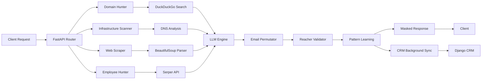

# Corporate Intel SaaS

[](https://fastapi.tiangolo.com/)
[](https://www.python.org/)
[](LICENSE)
[](https://render.com)

**Automated Corporate Intelligence Engine** – Enterprise-grade API for discovering company insights, infrastructure details, and verified contact information through AI-powered deep-scanning.

---

## Features

### Deep Company Enrichment
- **Automated Domain Discovery** – Finds official websites using advanced search algorithms
- **Infrastructure Fingerprinting** – Detects email providers (Google Workspace, Microsoft 365, etc.) and cloud hosting
- **Technology Stack Analysis** – Identifies marketing tools, CMS platforms, and web technologies
- **Social Media Intelligence** – Extracts LinkedIn, Twitter, Facebook, and other social profiles

### Contact Intelligence
- **Smart Email Discovery** – Generates and validates executive email addresses with 95%+ accuracy
- **Pattern Learning Engine** – Learns domain-specific email formats for faster future enrichment
- **Real-time Email Verification** – Uses Reacher API to validate deliverability before saving
- **Role-Based Targeting** – Prioritizes C-Level, VPs, Directors, and key decision-makers

### AI-Powered Analysis
- **LLM-Driven Insights** – Powered by Mistral AI for business intelligence extraction
- **Service Classification** – Automatically categorizes company offerings and specializations
- **Intelligent Data Synthesis** – Combines scraped data, search results, and AI analysis

### Enterprise-Grade Security
- **JWT-Based Authentication** – Secure token management with automatic refresh
- **Cross-Domain Token Transfer** – Encrypted payload for CRM integration
- **Masked Email Preview** – Privacy-first teaser system before full reveal
- **Rate-Limited Validation** – Prevents abuse and ensures compliance

### Seamless CRM Integration
- **Background Asset Sync** – Automatically pushes enriched data to your CRM
- **Batch Contact Saving** – Efficient bulk operations with atomic transactions
- **Duplicate Prevention** – Smart company lookup before creation
- **Real-Time Status Logging** – Comprehensive audit trail

---

## System Architecture



---

## API Documentation

### POST `/api/v1/enrich`
Deep-scan a company and return comprehensive intelligence.

**Request:**
```json
{
  "company_name": "Acme Corporation",
  "website_url": "https://acme.com",
  "target_role": "CEO"
}
```

**Response:**
```json
{
  "company_profile": {
    "name": "Acme Corporation",
    "website": "https://acme.com",
    "description": "AI-powered analytics platform for enterprise data visualization",
    "industry": "SaaS",
    "employee_count": "50-100"
  },
  "infrastructure": {
    "email_provider": "Google Workspace",
    "cloud_hosting": ["Cloudflare", "AWS"]
  },
  "technologies": ["React", "Docker", "PostgreSQL"],
  "services": ["Data Analytics", "Machine Learning APIs"],
  "contact_details": {
    "emails": ["contact@acme.com"],
    "phones": ["+1-555-0123"],
    "social_links": {
      "linkedin": "https://linkedin.com/company/acme",
      "twitter": "https://twitter.com/acmecorp"
    }
  },
  "key_people": [
    {
      "name": "John Doe",
      "role": "CEO",
      "email": "j****@acme.com",
      "email_status": "verified",
      "contact_id": 12345,
      "company_id": 789
    }
  ],
  "sources": ["https://acme.com", "Google Serper"]
}
```

### POST `/api/v1/reveal-email`
On-demand email discovery with pattern learning.

**Request:**
```json
{
  "full_name": "Jane Smith",
  "domain": "acme.com"
}
```

**Response:**
```json
{
  "email": "jane.smith@acme.com",
  "status": "safe",
  "confidence_score": 0.95
}
```

### POST `/api/v1/generate-reveal-token`
Generate a secure JWT for cross-domain CRM contact reveal.

**Request:**
```json
{
  "contact_id": 12345,
  "company_id": 789,
  "company_name": "Acme Corporation",
  "contact_name": "John Doe"
}
```

**Response:**
```json
{
  "token": "eyJhbGciOiJIUzI1NiIsInR5cCI6IkpXVCJ9...",
  "redirect_url": "https://crm.example.com/dashboard?reveal_token=...",
  "expires_in_minutes": 5
}
```

### GET `/health`
Health check endpoint for monitoring and load balancers.

**Response:**
```json
{
  "status": "active",
  "version": "2.0.0"
}
```

---

## Installation

### Prerequisites
- Python 3.8 or higher
- Active API Keys:
  - [Mistral AI](https://mistral.ai/) – LLM engine
  - [Serper.dev](https://serper.dev/) – Search API
  - Reacher – Email validation service

### Local Development

**1. Clone the repository**
```bash
git clone https://github.com/rayeesansariwork/corporate-intel-saas.git
cd corporate-intel-saas
```

**2. Create virtual environment**
```bash
python -m venv venv
source venv/bin/activate  # On Windows: venv\Scripts\activate
```

**3. Install dependencies**
```bash
pip install -r requirements.txt
```

**4. Configure environment variables**

Create a `.env` file in the root directory:
```env
# API Keys
MISTRAL_API_KEY=your_mistral_api_key
SERPER_API_KEY=your_serper_api_key

# Security
API_SECRET_KEY=your_random_secret_key
JWT_SECRET_KEY=your_jwt_secret_key

# CRM Integration
SAVE_ENRICHMENT_URL=https://your-crm.com/api/v1/companies/save_enrichment_data/
SAVE_ENRICHMENT_EMAIL=your_crm_email@example.com
SAVE_ENRICHMENT_PASSWORD=your_crm_password
TOKEN_OBTAIN_URL=https://your-crm.com/api/token/obtain/

# Frontend Redirect
CRM_LANDING_PAGE_URL=https://your-frontend.com/agency/dashboard
```

**5. Run the development server**
```bash
uvicorn app.main:app --reload --port 8001
```

**6. Access API documentation**
- Swagger UI: http://localhost:8001/docs
- ReDoc: http://localhost:8001/redoc

---

## Docker Deployment

```bash
# Build the image
docker build -t corporate-intel-saas .

# Run the container
docker run -d -p 8001:8001 --env-file .env corporate-intel-saas
```

---

## Production Deployment

### Render

This project includes `render.yaml` for automated deployment.

1. Fork this repository
2. Connect to [Render Dashboard](https://dashboard.render.com/)
3. Create a new Web Service and select the repository
4. Configure environment variables in the Render dashboard
5. Deploy (Render will automatically detect `render.yaml`)

**Production URL:** `https://corporate-intel-api.onrender.com`

### Manual Deployment

For other platforms (AWS, GCP, Azure), use the provided `Dockerfile` or deploy directly with:

```bash
uvicorn app.main:app --host 0.0.0.0 --port $PORT
```

Ensure all environment variables are configured in your hosting platform.

---

## Project Structure

```
corporate-intel-saas/
├── app/
│   ├── api/
│   │   └── v1/
│   │       └── endpoints.py       # API routes and business logic
│   ├── core/
│   │   └── security.py            # Authentication utilities
│   ├── models/
│   │   └── schemas.py             # Pydantic models
│   ├── services/
│   │   ├── search_engine.py       # Domain & employee hunters
│   │   ├── scraper.py             # Async web scraper
│   │   ├── infrastructure.py      # DNS & email provider detection
│   │   ├── llm_engine.py          # Mistral AI integration
│   │   ├── email_engine.py        # Email validation & permutation
│   │   ├── pattern_engine.py      # Email pattern learning
│   │   ├── tech_hunter.py         # Technology stack detection
│   │   ├── token_generator.py     # JWT token creation
│   │   └── token_manager.py       # CRM authentication
│   ├── config.py                  # Environment configuration
│   ├── logging_config.py          # Structured logging
│   └── main.py                    # FastAPI application entry
├── logs/                          # Application logs
├── .env                           # Environment variables (gitignored)
├── .gitignore
├── Dockerfile                     # Container configuration
├── Procfile                       # Heroku/Render deployment
├── render.yaml                    # Render deployment config
├── requirements.txt               # Python dependencies
└── README.md
```

---

## Technology Stack

| Component | Technology | Purpose |
|-----------|-----------|---------|
| **Framework** | FastAPI 0.100+ | High-performance async API |
| **AI Engine** | Mistral Small | LLM-powered analysis |
| **Search** | Serper.dev | Google SERP scraping |
| **Email Validation** | Reacher | Real-time deliverability check |
| **Web Scraping** | BeautifulSoup + httpx | Async HTML parsing |
| **DNS Analysis** | dnspython | Infrastructure fingerprinting |
| **Authentication** | PyJWT | Secure token management |
| **Async Runtime** | uvicorn + asyncio | Concurrent operations |
| **Retry Logic** | tenacity | Automatic failure recovery |

---

## Use Cases

### Sales Intelligence
Automate contact discovery for target accounts, reducing manual research time by 90%.

### Lead Enrichment
Enhance CRM records with comprehensive company data including infrastructure, technologies, and stakeholder information.

### Market Research
Analyze technology adoption patterns and infrastructure choices across competitors or market segments.

### Recruitment & Headhunting
Identify decision-makers and technical leaders at target organizations for outreach campaigns.

---

## Security Best Practices

- **Environment Variables** – Never commit `.env` files; use secure secret management
- **API Key Rotation** – Regularly rotate API keys, especially in production environments
- **HTTPS Enforcement** – Always use TLS for API communication in production
- **Rate Limiting** – Implement rate limiting to prevent abuse and control API costs
- **CORS Configuration** – Replace `allow_origins=["*"]` with specific whitelisted domains
- **Audit Logging** – Monitor logs for suspicious activity and API errors

---

## Performance Optimization

- **Async I/O** – All external API calls use `httpx.AsyncClient` for non-blocking operations
- **Background Tasks** – CRM synchronization runs asynchronously to avoid blocking responses
- **Batch Operations** – Contact saving uses single atomic transactions for efficiency
- **Pattern Caching** – Email pattern engine learns from successful validations
- **Configurable Timeouts** – 30-90 second timeouts for long-running operations

---

## Troubleshooting

### `ReadTimeout` errors during batch save
**Solution:** Increase timeout in `endpoints.py` (line 160) to `timeout=90.0` or higher. Verify CRM backend performance.

### Email validation failures
**Solution:** Verify Reacher API accessibility and check rate limits. Review logs in `logs/` directory for detailed error traces.

### Domain not found
**Solution:** Ensure `SERPER_API_KEY` is valid. Verify company name spelling or provide `website_url` directly in the request.

### CRM authentication fails
**Solution:** Confirm `TOKEN_OBTAIN_URL` is correct. Verify email/password credentials. Check `TokenManager` logs for JWT token issues.

### High API costs
**Solution:** Implement request caching, reduce validation frequency, or use pattern learning to minimize external API calls.

---

## Contributing

Contributions are welcome. Please follow these guidelines:

1. Fork the repository
2. Create a feature branch (`git checkout -b feature/feature-name`)
3. Commit changes with descriptive messages (`git commit -m 'Add feature description'`)
4. Push to the branch (`git push origin feature/feature-name`)
5. Open a Pull Request with detailed description

---

## License

This project is licensed under the MIT License. See [LICENSE](LICENSE) file for details.

---

## Contact

**Developer:** Rayees Ansari  
**GitHub:** [@rayeesansariwork](https://github.com/rayeesansariwork)  
**Repository:** [https://github.com/rayeesansariwork/corporate-intel-saas](https://github.com/rayeesansariwork/corporate-intel-saas)

---

## Acknowledgments

- [FastAPI](https://fastapi.tiangolo.com/) – Modern Python web framework
- [Mistral AI](https://mistral.ai/) – Powerful LLM infrastructure
- [Serper.dev](https://serper.dev/) – Google search API
- [Reacher](https://reacher.email/) – Email verification service

---

<div align="center">

**Enterprise Sales Intelligence Platform**

[](https://github.com/rayeesansariwork/corporate-intel-saas)

</div>
